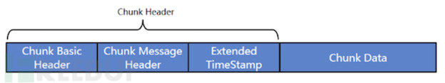
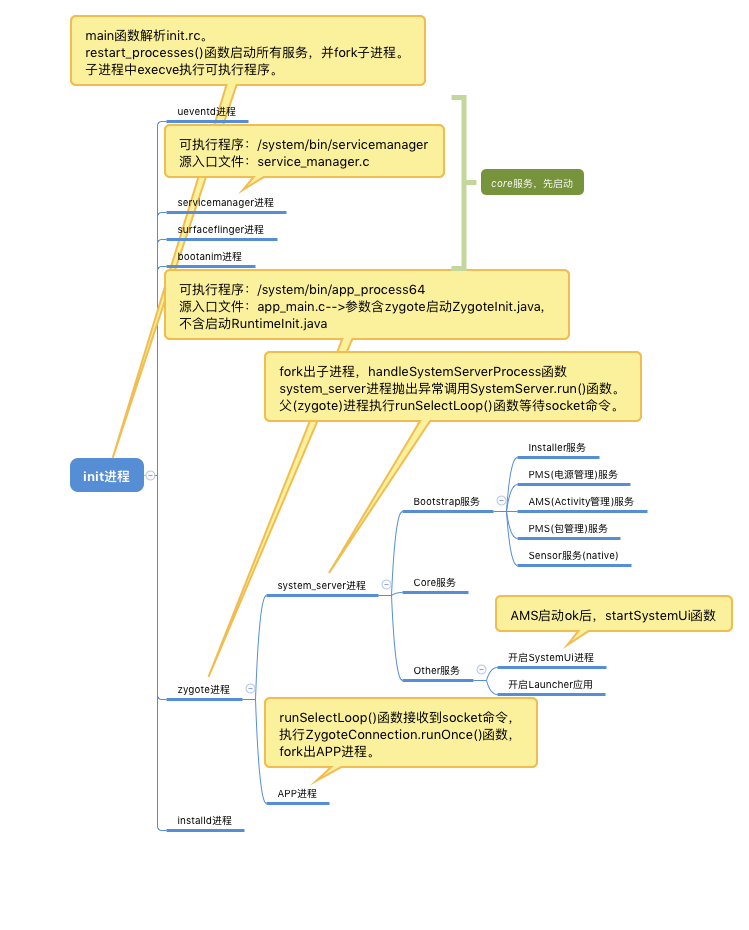

# 面试汇总
* **自定义控件**
    ① onMeasure：测量控件，参数是父控件建议子控件的宽高、模式。
        
        MeasureSpec的三种测量模式：
            I. UNSPECIFIED(未指定)：父控件没有施加任何约束。例：ListView、ScrollView。
            II. EXACTLY(完全)：父控件决定了子控件的确切大小。例：match_parent、布局中指定控件的具体数值。
            III. AT_MOST(至多)：父控件无法确定子控件大小。例：wrap-content。

    ② onLayout：排放子控件。
        
    ③ onDraw：绘制(ViewGroup)背景、(View)内容。

    ④ attrs.xml：资源文件中--values/attrs.xml中用于定义自定义控件的属性(xml布局中)。使用TypeArray解析xml布局中的值(使用完毕，记得释放)。
---

* **性能优化**
    ① 内存优化  
        
        常见内存泄漏
            I.   工具类引用Context上下文。
            II.  匿名内部类(Thread、AsyncTask)。
            III. Handler
            IV.  IO操作(文件、数据库、流)、Bitmap资源、TypeArray资源未释放。
            V.   无限循环动画，在Activity结束时为调用cancle函数。(AnimaterHandler)
            VI.  系统服务的监听器(Sensor)，未反注册。
            VII. WebView

        内存泄漏检测工具
            I.  LeakCanary
            II. Android Profiler(AS自带工具)
    ② 渲染优化
        
        布局优化
            I.   include标签
            II.  megre标签
            III. ViewStub标签
            IV.  HierarchView工具查看控件测量、摆放、绘制耗时时间。

        过度绘制
            I.   默认主题会有一个背景，此时根布局再设置背景，会造成2X渲染。
            II.  ViewGroup设置背景，会增加一次绘制。
            III. 可以查看布局是否是过度绘制。(开启过度绘制的方法：开发者选项->调试GPU过度绘制)

        内存抖动
            I.   频繁申请对象，会导致GC频繁调用，阻塞主线程，造成界面卡顿。
            II.  计算量过大，导致界面卡顿。

    ③ 启动优化
        
        启动时间统计：adb shell am start -W [packageName]/[packageName.MainActivity]

        例：adb shell am start -W com.gzsll.hupu/com.gzsll.hupu.SplashActivity

        thisTime:SplashAcitivity时间

        totalTime:Application+SplashActivity时间

        waitTime:包含系统影响时间
        
        I.   不要在Application的attachBaseContext()、onCreate()方法中，做初始化、耗时操作。
        II.  Splash和Main合并成一个界面，达到预加载主界面内容。
        III. 修改Window背景防止白屏。
---
* 网络协议
    ①TCP与UDP区别：
        
        I.   TCP面向连接，UDP无连接。
        II.  TCP基于流模式，UDP数据报文模式。
        III. TCP保证数据顺序、正确性，UDP不保证。

        TCP三次握手：
            client                                      server
               |-----------------SYN=1 seq=x------------->|
               |<-----SYN=1 ACK=1 seq=y ACKnum=x+1--------|
               |---------SYN=0 ACK=1 ACKnum=y+1---------->|
            为什么需要三次握手？：
                client ----在吗？----> server//客户端询问服务端
                client <-----在------ server//服务端回复客户端，客户端确认可以跟服务端建立连接(此时服务端还没有确认客户端是否可以建立连接)。
                client ----好的！----> server//客户端回复服务端，服务端确认可以建立连接。
        TCP四次挥手：
            client                                      server
               |----------------FIN=1 seq=x-------------->|
               |<---------ACK=1 seq=y ACKnum=x+1----------|
               |<------FIN=1 ACK=1 seq=z ACKnum=x+1-------|
               |---------ACK=1 seq=u+1 ACKnum=z+1-------->|
            为什么需要四次挥手？：
                client -----------我要关闭流了---------> server
                client <----等一下，我还有数据没处理完---- server
                client ----好了，我处理完了，可以关了----> server
                client -------------好的！------------> server
    ②Http和Https的区别
        
        I. Http明文传输，Https加密传输。

        Https传输过程：
            client                     server
               |---------请求网站-------->|//证书包含公钥、私钥
               |<----------公钥----------|//返回公钥，client验证合法性，不合法提示、终止！合法生成随机key使用公钥加密key。
               |---------随机key-------->|//client随机生成key，使用公钥加密，传给server。服务器使用私钥解密获取key。
               |<----------响应----------|//使用key加密，响应。客户端使用key解密
    ③XMPP协议

        <stream:stream>
            //iq 查询/信息
            <iq from="xxx@yyy"  
                id="rr82a1z7"
                to="yyy" 
                type="get">// get类似http的Get请求 set类似http的Post请求，result返回结果，error错误消息
                <query xmlns="jabber:iq:roster">
                    <item jid="gmz@skh.whu.edu.cn"/>// 添加的联系人
                </query>
            </iq>

            <presence from="xxx@yyy"> 
                <show>aa</show>
                <status>bbb</status>//在线状态
            </presence>
            
            <message from="xxx@yyy" //消息发送者
              to="xxx.yyy" //消息接收者
              type="chat" //消息类型>
              <body>zzzz</body>//消息内容
              <active xmlns="http://jabber.org/protocol/chatstates"> //聊天状态 active paused composing gone
            </message>
        </stream:stream>
    ④RTMP协议

        client          server
           |------C0+C1----->|//服务端要等到C0后才能发送S1,等到C1后才能发送S2
           |<----S0+S1+S2----|//客户端需要等到S1后才能发送C2,等到S2后才能发送其他消息。
           |--------C2------>|
           
        C0/S0：version(1字节)
        C1/S1：time(4字节)|version(4字节)|digest(764字节)|key(764字节) ps:digest和key在不同的类库中顺序可能会不一样。
        C2/S2：random-data(1504字节)|digest-data(32字节)。

    
    [参考](https://hk.saowen.com/a/90258deff9be6e4af492cbfe555dc0e40263f5964ce3eb498fb48e56a6b95406)    

        Base Header(1-3字节)：csid=0、1、2协议保留
        1字节：0 1 2 3 4 5 6 7
             |fmt|   cs id   | //fmt：2bit csid：6bit(<=64)
        2字节：0 1 2 3 4 5 6 7 0 1 2 3 4 5 6 7
             |fmt|     0     |     cs id     | //csid：(64<csid<319)
        3字节：0 1 2 3 4 5 6 7 0 1  2 3 4 5 6 7 0 1 2 3 4 5 6 7
             |fmt|     1     |              cs id             | //csid：(64<csid<65536)
        
        Message Header：(由Base Header的fmt决定)
        (fmt=0)11字节：0 1 2 3 4 5 6 7 0 1 2 3 4 5 6 7 0 1 2 3 4 5 6 7 0 1 2 3 4 5 6 7
                     |                 time stamp                    | messagelength\|
                      0 1 2 3 4 5 6 7 0 1 2 3 4 5 6 7 0 1 2 3 4 5 6 7 0 1 2 3 4 5 6 7
                     |         messagelength         |message type id|msg stream id\ |
                      0 1 2 3 4 5 6 7 0 1 2 3 4 5 6 7 0 1 2 3 4 5 6 7
                     |              message stream id                |
                     time stamp：占用3字节，当3字节不能存储time stamp时置为1，time stamp将被存储到Extended Timestamp
                     message length：占用3字节，表示实际发送消息的长度，包含头。
                     message type id：占用1字节，表示实际发送消息的类型。8：音频、9：视频
                     message stream id：

        (fmt=1)7字节：0 1 2 3 4 5 6 7 0 1 2 3 4 5 6 7 0 1 2 3 4 5 6 7 0 1 2 3 4 5 6 7
                    |                time stamp delta               | messagelength\|
                     0 1 2 3 4 5 6 7 0 1 2 3 4 5 6 7 0 1 2 3 4 5 6 7 
                    |         messagelength         |message type id|
                    time stamp delta：与上一个chunk的timestamp的差值。

        (fmt=2)3字节：0 1 2 3 4 5 6 7 0 1 2 3 4 5 6 7 0 1 2 3 4 5 6 7 
                    |                time stamp delta               |
                    
        (fmt=3)0字节：表示与上一个chunk的Message Header相同。    
---

* **各种机制、流程**

    ①Binder机制

    ②事件机制

    ③Handler机制

        Handler Message MessageQueue Looper
        ThreadLocal(每个线程都有一份独立的数据)原理：
            
            ThreadLocalMap getMap(Thread t) {
                return t.threadLocals;//每个线程有一个独立的ThreadLocalMap。
            }

            void createMap(Thread t, T firstValue) {
                t.threadLocals = new ThreadLocalMap(this, firstValue);
            }
            -------------------------------------------------------------
            set():
            public void set(T value) {
                Thread t = Thread.currentThread();//获取当前线程
                ThreadLocalMap map = getMap(t);//
                if (map != null)
                    map.set(this, value);
                else
                    createMap(t, value);//
            }
            -------------------------------------------------------------

    ④热修复原理

        PathClassLoader：

        DexClassLoader：

    ⑤JNI原理

        System.loadLibrary()：找到指定的so，调用dlopen函数打开so，dlsym调用JNI_OnLoad
---
* **启动流程**

    ①系统启动流程
        开机电源-->BIOS-->MBR-->GRUB-->kernel-->init进程。
        

    ②APP启动流程
---
* **音视频**

    ①H264编码

    ②AAC编码

    ③mp4格式

    ④FLV格式

* **OpenGL ES**

    ①OpenGL渲染管线：顶点数据-->顶点着色器-->细分着色器-->几何着色器-->图元装配-->剪切-->光栅化-->片元着色器
        
        顶点着色器：处理顶点相关的数据。
        细分着色器：会在OpenGL管线内部生成新的几何体
        几何着色器：
        图元装配：
        剪切：
        光栅化：
        片元着色器：

